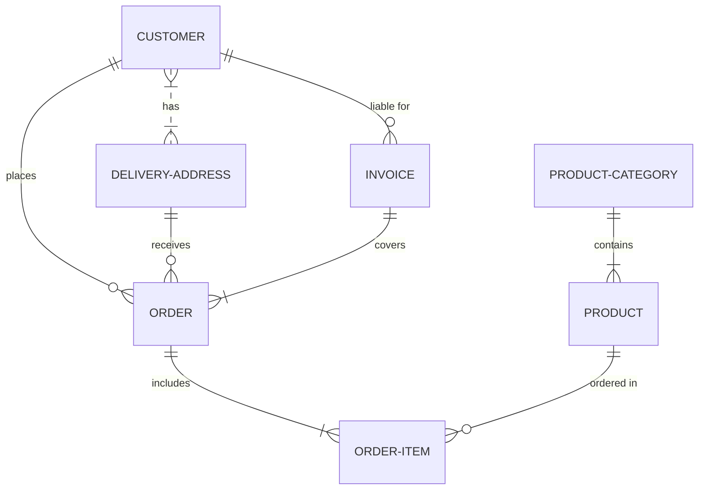

# Presentación en linea de las clases de PostgreSQL

>[!NOTE]
> Usando como librería: [reveal.js-plugins](https://github.com/rajgoel/reveal.js-plugins)

>[!WARNING]
> Advertencia

>[!TIP]
> Tips

>[!IMPORTANT]
> Importante

>[!CAUTION]
> Precaución

