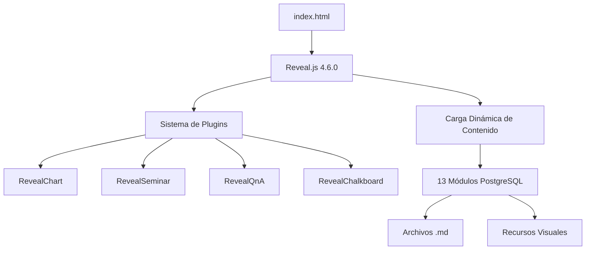
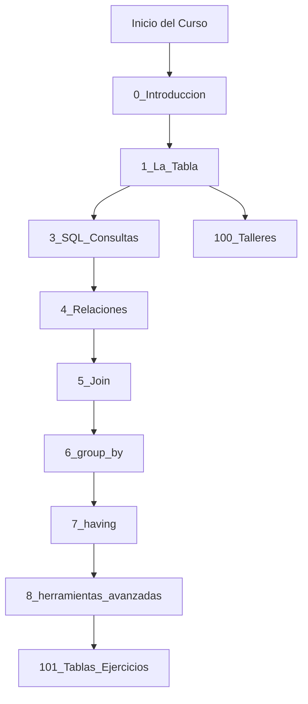
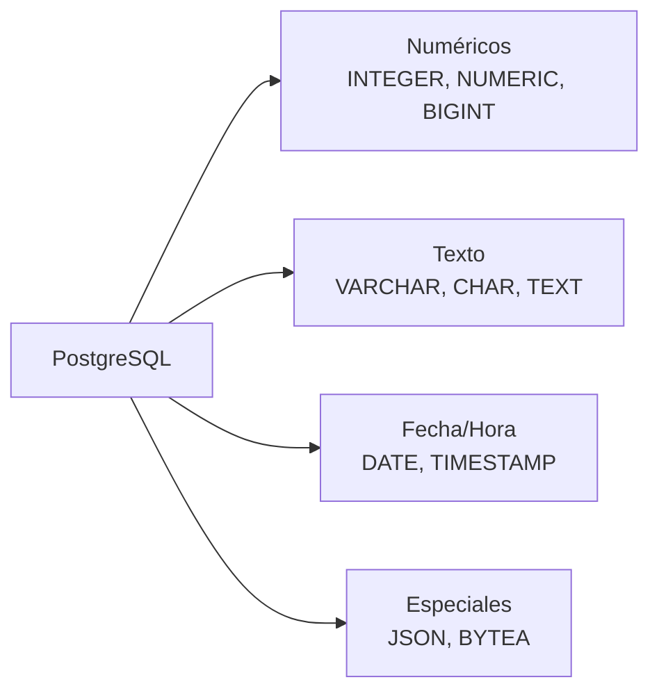
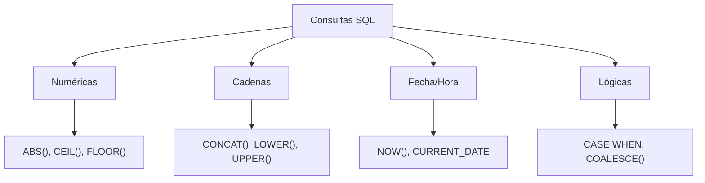
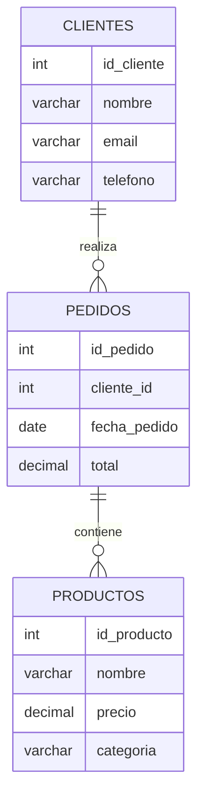
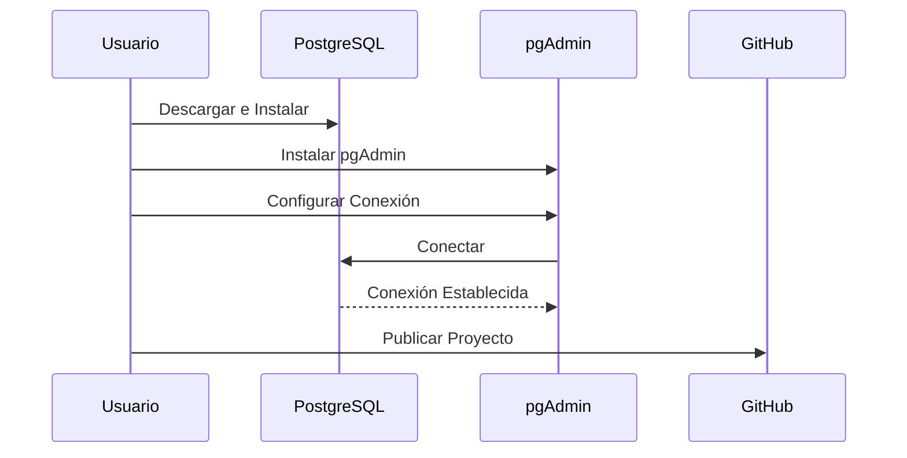
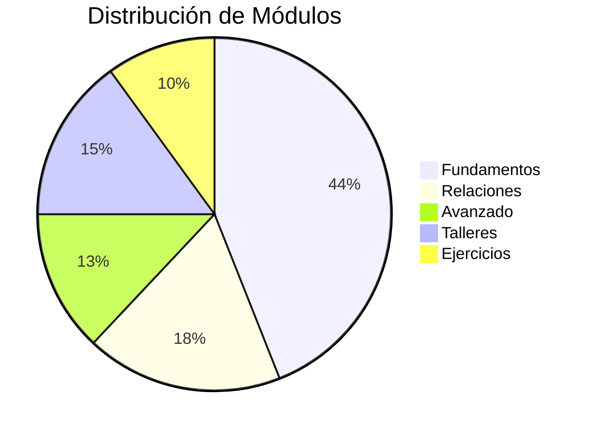
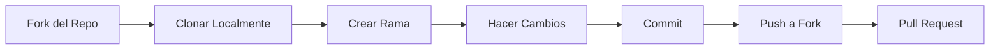

# PostgreSQL-Nivel-0 🐘

Este repositorio contiene un curso educativo completo de PostgreSQL nivel básico, implementado como una plataforma de presentaciones interactivas usando Reveal.js. [1](#3-0) 

## 🎯 Objetivos del Curso

El curso está diseñado para enseñar los fundamentos de PostgreSQL a través de objetivos específicos:

- **🗄️ Bases de datos Relacionales**: Comprender la estructura de datos en tablas relacionadas
- **📊 Tablas**: Crear y gestionar tablas de forma eficiente  
- **🔗 Relaciones entre tablas**: Establecer relaciones mediante claves primarias y foráneas
- **🛠️ CRUD**: Realizar operaciones básicas (Crear, Leer, Actualizar, Eliminar)
- **🔍 Consultas SQL**: Ejecutar consultas para recuperar y manipular datos
- **🚀 Publicar en GitHub**: Desarrollar y publicar una base de datos en GitHub

## 📋 Requisitos del Sistema

Para utilizar esta plataforma educativa necesitas:

- **💻 Computadora**: Equipo adecuado para desarrollo y gestión de bases de datos
- **🌐 Conexión a Internet**: Para colaboración y acceso a recursos en la nube
- **☁️ Servidor PostgreSQL**: Instancia de PostgreSQL en la nube
- **💻 pgAdmin**: Herramienta de gestión de bases de datos
- **🌐 GitHub**: Para versionado y colaboración de proyectos
- **🧑‍🤝‍🧑 Trabajo en equipo**: Colaboración activa con otros desarrolladores
- **⚙️ Metodologías ágiles**: Uso de Scrum o Kanban

## 🚀 Instalación y Configuración

### PostgreSQL y pgAdmin

1. **Descargar PostgreSQL**: Obtén la versión más reciente desde el sitio oficial. PostgreSQL es completamente gratuito y de código abierto.

2. **Instalar pgAdmin**: Descarga desde `https://www.pgadmin.org/download/` y sigue las instrucciones de instalación.

3. **Configurar conexión**:
   - **Host**: `tu-host.com / IP`
   - **Puerto**: `5432` (por defecto)
   - **Usuario**: `tu_usuario`
   - **Contraseña**: `tu_clave_secreta`
   - **Base de datos**: `tu_base_de_datos`

## 📚 Estructura del Curso

### Arquitectura del Sistema de Presentación



### Flujo de Aprendizaje PostgreSQL



### Módulos Principales

1. **0_Introduccion** - Conceptos fundamentales de proyectos IT y requisitos
2. **1_La_Tabla** - Diseño de tablas y tipos de datos [2](#3-1) 
3. **3_SQL_Consultas** - Consultas SQL y funciones
4. **4_Relaciones** - Relaciones entre tablas (1:1, 1:M, M:M)
5. **5_Join** - Operaciones JOIN
6. **6_group_by** - Agrupación de datos
7. **7_having** - Filtros avanzados
8. **8_herramientas_avanzadas** - Vistas, funciones, procedimientos y triggers

### Ejercicios Prácticos

- **100_Talleres** - Configuración de herramientas y talleres prácticos
- **101_Tablas_Ejercicios** - Ejercicios de creación de tablas para diferentes sectores [3](#3-2) 
- **400_GITHUB** - Uso de GitHub para proyectos de bases de datos [4](#3-3) 
- **500_TRELLO** - Gestión de proyectos con Trello

## 🛠️ Características Técnicas

### Plataforma de Presentación

El curso utiliza **Reveal.js** como framework de presentación con características avanzadas: [5](#3-4) 

- **Plugin Anything**: Para contenido interactivo y elementos HTML personalizados
- **Plugin Seminar**: Para colaboración en tiempo real y sistema de Q&A
- **Chart.js**: Para visualizaciones de datos
- **Chalkboard**: Para anotaciones interactivas
- **Mermaid**: Para diagramas y gráficos [6](#3-5) 

### Convenciones de Código

El curso enseña las mejores prácticas de nomenclatura:

- **snake_case**: Para nombres de columnas (`fecha_nacimiento`)
- **Descriptivo y conciso**: Nombres claros (`correo_electronico`)
- **Patrones consistentes**: Prefijos y sufijos estándar (`id_usuario`, `categoria_id`)

## 📊 Conceptos PostgreSQL Cubiertos

### Tipos de Datos PostgreSQL



#### Tipos de Datos Detallados

- **Numéricos**: `INTEGER`, `NUMERIC(10,2)`, `BIGINT`, `SMALLINT`, `REAL`
- **Texto**: `VARCHAR(50)`, `CHAR(10)`, `TEXT`, `ENUM`
- **Fecha/Hora**: `DATE`, `TIMESTAMP`, `TIMESTAMPTZ`, `TIME`
- **Especiales**: `JSONB`, `BYTEA`, `GEOGRAPHY`, `UUID`, `ARRAY`

### Funciones SQL por Categoría



El curso cubre diferentes categorías de funciones PostgreSQL: [7](#3-6) 

- **Numéricas**: `ABS()`, `CEIL()`, `FLOOR()`, `ROUND()`
- **Cadenas**: `CONCAT()`, `LOWER()`, `UPPER()`, `STRING_AGG()`
- **Fechas**: `NOW()`, `CURRENT_DATE`, `TO_CHAR()`
- **Lógicas**: `CASE WHEN`, `COALESCE()`, `NULLIF()`

### Arquitectura de Relaciones de Base de Datos



### Configuración del Entorno de Desarrollo



### Distribución del Curso



## 🎓 Cómo Usar Este Repositorio

1. **Clonar el repositorio**:
   ```bash
   git clone https://github.com/sanchezluys/PostgreSQL-Nivel-0.git
   ```

2. **Abrir las presentaciones**: Navega a `index.html` en tu navegador web

3. **Seguir el orden de módulos**: Comienza con `0_Introduccion` y progresa secuencialmente

4. **Practicar con ejercicios**: Utiliza los talleres en `100_Talleres` y `101_Tablas_Ejercicios`

5. **Configurar PostgreSQL**: Sigue las instrucciones en el módulo de talleres para configurar tu entorno

### Navegación en las Presentaciones

- **Menú**: Accede al menú lateral para navegar entre módulos
- **Controles**: Usa las flechas del teclado o los controles en pantalla
- **Pizarra**: Presiona 'B' para activar la pizarra interactiva
- **Q&A**: Presiona 'Q' para el sistema de preguntas y respuestas

## 🛠️ Ejercicios Prácticos Incluidos

### Ejercicios Industriales

El repositorio incluye ejercicios específicos para el sector industrial: [3](#3-2) 

- Tabla de Máquinas y Equipos
- Mantenimiento Preventivo
- Inventario de Materias Primas
- Seguridad Industrial
- Proveedores Industriales
- Productos Químicos
- Equipos de Protección Personal (EPP)
- Proyectos Industriales
- Herramientas
- Producción Diaria

### Ejercicios de Zapaterías

También incluye ejercicios específicos para el sector de calzado y zapaterías, cubriendo aspectos como gestión de inventario, producción, proveedores y diseños.

## 🤝 Contribuciones

Este es un proyecto educativo diseñado para aprendizaje colaborativo usando metodologías ágiles y GitHub para versionado.

### Estructura de Contribución



## 📄 Licencia

PostgreSQL es un sistema de gestión de bases de datos completamente gratuito y de código abierto.

## 🔗 Enlaces Útiles

- [PostgreSQL Oficial](https://www.postgresql.org/)
- [pgAdmin](https://www.pgadmin.org/)
- [Reveal.js](https://revealjs.com/)
- [Mermaid Diagrams](https://mermaid.js.org/)

---

**Autor**: Luis Sánchez  
**Repositorio**: [PostgreSQL-Nivel-0](https://github.com/sanchezluys/PostgreSQL-Nivel-0)  
**Versión**: 1.0  
**Última actualización**: 2025

## 📞 Contacto

Para preguntas, sugerencias o contribuciones, puedes:
- Abrir un issue en GitHub
- Crear un pull request
- Contactar al autor a través de GitHub

[](https://deepwiki.com/sanchezluys/PostgreSQL-Nivel-0)